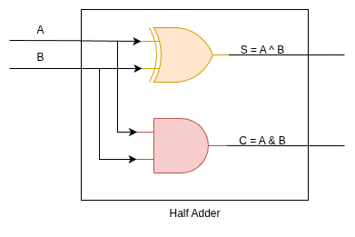
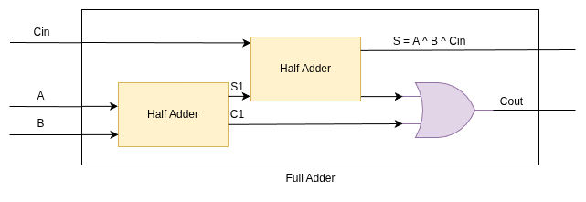
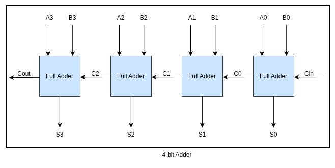

# Somador Quebrado

Em todas as atividades até agora, você implementou uma solução e teve um **testbench** pronto para testar sua criação. Desta vez, no entanto, as coisas seguirão por um caminho um pouco diferente.

O autor desta atividade — em um momento de ambição ou talvez apenas falta de café — resolveu implementar um somador por conta própria. Infelizmente, em algum ponto do processo o café acabou, o sono bateu, e o resultado foi uma implementação... digamos, duvidosa. O somador não está somando como deveria, e ainda por cima alguns erros de síntese começaram a aparecer. Parece que vírgulas, pontos e fios foram colocados e/ou removidos de onde não deviam.

Agora é com você: sua missão é **testar**, **detectar os erros** e **corrigir** esse somador.

---

## A Missão

Você deve implementar um **testbench** que consiga identificar os problemas na implementação do somador de 4 bits com **carry out**. Depois disso, é claro, precisa **corrigir** a implementação para que ela funcione corretamente. A implementação original está dividida nos arquivos `hadd.v`, `fadd.v` e `add.v`.

---

## Como deveria funcionar o somador

Diferente das outras vezes em que usamos diretamente o operador `+` e deixamos o trabalho pesado para a ferramenta de síntese, o autor decidiu implementar o somador **do zero**, utilizando três módulos: meio somador, somador completo e somador de 4 bits.

### Meio Somador (Half Adder)

O meio somador recebe dois bits de entrada, `A` e `B`, e fornece duas saídas:

* `S`: o bit da soma
* `C`: o carry out

Equações lógicas esperadas:

```
S = A ^ B
C = A & B
```

**Tabela verdade esperada:**

| A | B | S | C |
| - | - | - | - |
| 0 | 0 | 0 | 0 |
| 0 | 1 | 1 | 0 |
| 1 | 0 | 1 | 0 |
| 1 | 1 | 0 | 1 |



---

### Somador Completo (Full Adder)

O somador completo é formado pela junção de dois meios somadores e acrescenta um **carry-in** (entrada de vai-um). Ele recebe três entradas: `A`, `B` e `Cin`, e gera duas saídas: `S` (soma) e `Cout` (carry out).

Equações lógicas esperadas:

```
S    = A ^ B ^ Cin
Cout = (A & B) | (A & Cin) | (B & Cin)
```

**Tabela verdade esperada:**

| A | B | Cin | S | Cout |
| - | - | --- | - | ---- |
| 0 | 0 | 0   | 0 | 0    |
| 0 | 0 | 1   | 1 | 0    |
| 0 | 1 | 0   | 1 | 0    |
| 0 | 1 | 1   | 0 | 1    |
| 1 | 0 | 0   | 1 | 0    |
| 1 | 0 | 1   | 0 | 1    |
| 1 | 1 | 0   | 0 | 1    |
| 1 | 1 | 1   | 1 | 1    |



---

### Somador de 4 Bits

Por fim, o somador de 4 bits é composto por quatro somadores completos, conectados em série. O **carry-out** de cada estágio é passado como **carry-in** para o estágio seguinte. O carry-in do primeiro somador é 0, e o carry-out final é a saída geral do módulo.



---

## Atividade

1. Implemente o **testbench** no arquivo `tb.v` utilizando o template abaixo:

```verilog
`timescale 1ns/1ps

module tb();

reg [3:0] num1;
reg [3:0] num2;
wire [3:0] out;
wire cout;

add u0 (
    .num1 (num1),
    .num2 (num2),
    .out  (out),
    .cout (cout)
);

initial begin
    // Insira o seu teste aqui
end

endmodule
```

2. **Teste o somador** com vários pares de entradas.
3. **Identifique comportamentos incorretos.**
4. **Corrija os erros** nos arquivos `hadd.v`, `fadd.v` e `add.v`.

---

## Entrega

Nesta atividade, o sistema de correção automática do **GitHub Classroom** não fornecerá um feedback detalhado equivalente à correção final. Ele apenas verifica se os arquivos foram entregues corretamente e se passam pelo **testbench construído por você**. A avaliação completa será realizada utilizando um **testbench de referência** aplicado aos **módulos corrigidos**, além da análise do seu próprio testbench.

Dessa forma, recomenda-se fortemente a elaboração de testes robustos, que cubram **casos de borda** e explorem as possíveis falhas encontradas na implementação original.

> **Dica:**
>
> * O script `./run.sh` realiza a compilação, síntese e execução do seu testbench juntamente com os módulos implementados.
> * Já o script `./run-all.sh` também executa a simulação, porém **limita a saída apenas às palavras "OK" ou "ERRO"**, conforme identificadas nas linhas de resultado. Isso pode ser útil para obter uma visão geral da execução, especialmente se o seu testbench fornecer algum tipo de retorno textual baseado nessas palavras-chave.
